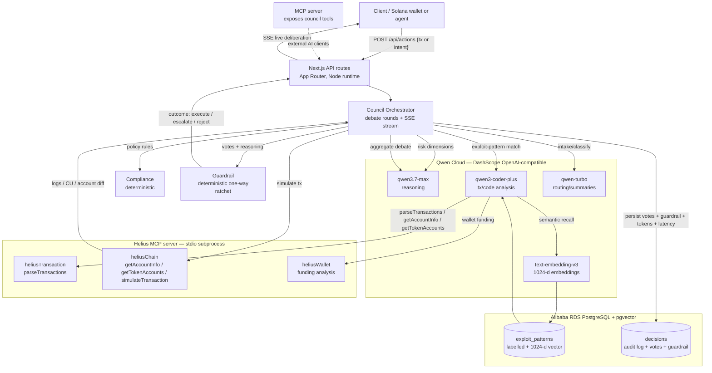

# Architecture — On-Chain Risk Council

## System diagram

## Request flow
1. **Submit** — a client posts an action (a Solana transaction signature, a
   serialized base64 tx, or a natural-language intent) to `POST /api/actions`.
2. **Intake** (`qwen-turbo`) parses and classifies it (transfer / swap /
   authority-delegation / config / unknown) and extracts a *trusted action
   record*: amount, counterparties, mints, authority changes, reversibility.
3. **Parallel debate round** — Risk Analyst, Exploit Skeptic, Compliance each
   produce a structured verdict. Exploit Skeptic pulls on-chain evidence via
   Helius MCP and semantically recalls similar labelled exploits from pgvector.
4. **Simulation** — the Simulator fork-simulates the tx via Helius
   `simulateTransaction`; logs, compute units and pre/post account diffs feed
   back into the Referee.
5. **Referee** (`qwen3.7-max`) aggregates the debate and votes last, can be
   talked out of a position by the Skeptic's evidence.
6. **Guardrail** (deterministic code) reads `stakes` + `reversibility` from the
   *trusted* action record — never from model output — and applies a one-way
   ratchet: it can only make the outcome safer. A unanimous "execute" on an
   irreversible / high-stakes action is still **escalated** to a human.
7. **Stream + persist** — every step streams to the client over SSE (live
   deliberation chamber); the final decision, per-agent votes, guardrail
   reason, token cost and latency are written to the `decisions` audit log.

## Components (file map)
| Concern | Path |
|---|---|
| Qwen client + model registry | `lib/qwen.ts` |
| Helius MCP client | `lib/helius-mcp.ts` |
| pgvector memory + audit log | `lib/db.ts` |
| Deterministic guardrail | `lib/guardrail.ts` *(D2)* |
| Agents | `agents/{intake,riskAnalyst,exploitSkeptic,compliance,simulator,referee}.ts` *(D2–D3)* |
| Debate orchestration + SSE | `orchestrator/council.ts` *(D3)* |
| Council-as-MCP-server | `mcp-server/server.ts` *(D7)* |
| Benchmark | `benchmark/{dataset,runner,baselines}.ts` *(D5)* |
| API routes | `app/api/{actions,decisions,benchmark,stream,health}/route.ts` |
| Frontend | `app/page.tsx` (council chamber) + `app/benchmark/page.tsx` *(D6)* |
| Alibaba proof + deploy | `alibaba/proof.ts`, `alibaba/DEPLOY.md`, `Dockerfile` *(D7)* |

## Judging criteria mapping
- **Technical Depth & Engineering (30%)** — double MCP (consume Helius +
  expose council), multi-model routing, `simulateTransaction` in the loop,
  deterministic guardrail over LLM.
- **Innovation & AI Creativity (30%)** — on-chain agent society + one-way
  ratchet + simulation-in-the-loop; clean modular agent architecture.
- **Problem Value & Impact (25%)** — real on-chain drainer/exploit prevention;
  productizable (wallets/agents plug in via the council MCP server).
- **Presentation & Documentation (15%)** — this architecture diagram, SSE live
  demo, benchmark dashboard, README, dev.to build-in-public post.

## Safety / scope
- **Mainnet read-only.** The council never submits transactions; it only
  approves, escalates (HITL), or rejects. Simulation runs on a fork.
- No private keys handled. The `trusted action record` is derived from
  parsed on-chain data, not from model output, so a confidently-wrong agent
  cannot unlock an irreversible action.
