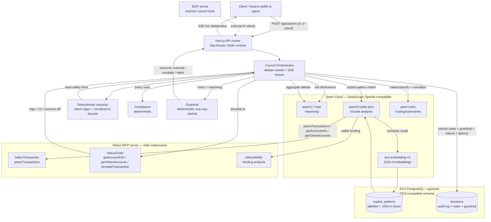

# Architecture — On-Chain Risk Council

## System diagram

## Request flow
1. **Submit** — a client posts an action (a Solana transaction signature, a
   serialized base64 tx, or a natural-language intent) to `POST /api/actions`.
2. **Intake** combines deterministic extraction with `qwen-turbo`: rule-based
   intent/evidence parsing plus serialized Solana transaction decoding via
   `@solana/web3.js`, then model normalization into a structured action record:
   amount, counterparties, mints, authority changes, reversibility. For
   signatures, intake first pulls parsed on-chain evidence through Helius MCP;
   for intent-only reviews it uses conservative defaults.
3. **Parallel debate round** — Risk Analyst, Exploit Skeptic, Compliance each
   produce a structured verdict. Exploit Skeptic pulls on-chain evidence via
   Helius MCP and semantically recalls similar labelled exploits from pgvector.
4. **Simulation** — the Simulator fork-simulates the tx via Helius
   `simulateTransaction`; logs, compute units and pre/post account diffs feed
   back into the Referee.
5. **Referee** (`qwen3.7-max`) aggregates the debate and votes last, can be
   talked out of a position by the Skeptic's evidence.
6. **Guardrail** (deterministic code) reads `stakes` + `reversibility` from the
   structured action record, not from free-text reasoning, and applies a one-way
   ratchet: it can only make the outcome safer. A unanimous "execute" on an
   irreversible / high-stakes action is still **escalated** to a human.
7. **Stream + persist** — every step streams to the client over SSE (live
   deliberation chamber); the final decision, per-agent votes, guardrail
   reason, token cost and latency are written to the `decisions` audit log.

## Components (file map)
| Concern | Path |
|---|---|
| Qwen client + model registry + token tracking | `lib/qwen.ts` |
| Deterministic action extraction | `lib/actionExtract.ts` |
| Helius MCP client (consume) | `lib/helius-mcp.ts` |
| pgvector memory + audit log | `lib/db.ts` |
| Deterministic guardrail | `lib/guardrail.ts` |
| Shared zod schemas | `lib/types.ts` |
| Synthetic exploit seeds | `lib/exploitSeeds.ts` |
| Agents | `agents/{intake,riskAnalyst,exploitSkeptic,compliance,simulator,referee}.ts` |
| Debate orchestration + SSE | `orchestrator/council.ts` |
| Council-as-MCP-server (expose) | `mcp-server/server.ts` |
| Benchmark | `benchmark/{dataset,baselines,runner}.ts` + `benchmark/results/` |
| API routes | `app/api/{actions,stream,health}/route.ts` |
| Frontend | `app/page.tsx` (council chamber) + `app/benchmark/page.tsx` (dashboard) |
| Scripts | `scripts/{smoke,probe_helius}.ts` |
| Alibaba proof + deploy | `alibaba/proof.ts`, `alibaba/proof.json`, `alibaba/DEPLOY.md`, `Dockerfile` *(ECS verified)* |

## Judging criteria mapping
- **Technical Depth & Engineering (30%)** — double MCP (consume Helius +
  expose council), multi-model routing, `simulateTransaction` in the loop,
  deterministic guardrail over LLM, **hash-chained audit log** (`lib/auditChain.ts`),
  trusted `reversible` invariant, CI + offline safety tests.
- **Innovation & AI Creativity (30%)** — on-chain agent society + one-way
  ratchet + simulation-in-the-loop + **cross-debate with monotonic safety floor**
  + **routine corridor** (efficiency without unlocking authority changes);
  Solana-domain specialization of the council pattern (not a generic chat swarm).
- **Problem Value & Impact (25%)** — real on-chain drainer/exploit prevention
  (Wormhole/Cashio signatures in bench); productizable MCP server for wallets.
- **Presentation & Documentation (15%)** — architecture diagram, SSE live
  chamber, conflict/held-back banners, benchmark dashboard, audit API, README,
  SUBMISSION.md, BLOG.md.

## Track 3 checklist (explicit)
| Requirement | Implementation |
|---|---|
| Task decomposition / roles | 6 specialised agents + deterministic extractor |
| Dialogue / negotiation | Cross-debate revision round (`preserveSafetyFloor`) |
| Conflict resolution | Split votes → referee + guardrail; UI `conflict` flag |
| Measurable vs single-agent | `benchmark/` lone-agent vs council artifact |
| Human-in-the-loop | escalate outcomes + held-back on high stakes |

## Safety / scope
- **Mainnet read-only.** The council never submits transactions; it only
  approves, escalates (HITL), or rejects. Simulation runs on a fork.
- No private keys handled. The guardrail reads structured fields from intake and
  can only move the result toward human review or rejection, so free-text agent
  reasoning cannot directly unlock an irreversible action.
