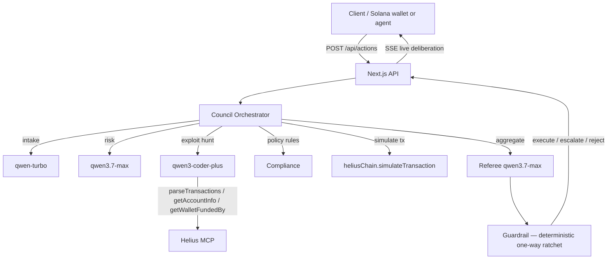

# Building an On-Chain Risk Council: a multi-agent society that reviews Solana actions before they execute

*Build-in-public post for the Global AI Hackathon with Qwen Cloud (Track 3: Agent Society).*

Solana drainers and exploiters cost users hundreds of millions of dollars a
year. The standard defense — "ask an LLM whether this transaction is safe" —
fails two ways: a single model confidently approves irreversible attacks it has
never seen before, and even a *correct* "looks safe" verdict carries no hard
safety floor. A fluent agent can talk its way past any threshold.

So I built an **On-Chain Risk Council**: a society of specialised Qwen agents
that deliberates over a high-stakes Solana action, then a **deterministic
one-way-ratchet guardrail** — keyed off a *trusted* action record derived from
on-chain data, never from model output — makes the final call. Consensus is
necessary, never sufficient: a unanimously-approved irreversible action is
still held back for a human.

## Why a society, not a hero

A single agent, however strong, has one perspective. Real transaction review
needs several: a **risk analyst** (amount, counterparty novelty, authority
changes), an **exploit skeptic** (matches known attack patterns, pulls
counterparty history on-chain), a **compliance officer** (policy rules), a
**simulator** (fork-runs the tx and reads the logs), and a **referee** that
votes last after seeing everyone else. Each is a narrow specialist; together
they cover blind spots no one agent has.

The referee is the strongest model (`qwen3.7-max`), but it is **not** the
decision-maker. The deterministic guardrail is. That separation is the whole
thesis: the LLM advises, code decides.

## Architecture



The action flows: **intake** (parse + classify) → **round 1** (risk analyst +
exploit skeptic + compliance in parallel, plus the simulator) → **round 2**
(cross-debate: each specialist sees the others' votes and may revise) →
**referee** → **guardrail**. Every step streams to the client over SSE so you
watch the council deliberate live.

## The deterministic guardrail (the actual decision-maker)

```
execute (0) < escalate (1) < reject (2)
```

The guardrail reads `stakes` and `reversibility` from the **trusted action
record** — derived from parsed on-chain data, not from anything a model said —
and can only move the outcome **up** the safety ranking, never down. Rules:
irreversible → at least escalate; high-stakes → at least escalate; authority
change → at least escalate; low mean confidence → at least escalate; any
`blocking_flag` from an agent → at least escalate. A unanimous "execute" on an
irreversible $12k payment is **held back** — that is the moment the demo shows.

A confidently-wrong agent cannot unlock an irreversible action, because the
guardrail never reads the agent's confidence as authority.

## Double MCP (the technical-depth play)

The council is on **both sides** of MCP:

1. **Consumes** the Helius MCP server — `parseTransactions`,
   `getAccountInfo`, `getWalletFundedBy`, `simulateTransaction` — as stdio
   tools, so the exploit skeptic reasons over real on-chain evidence, not
   guesses. (Helius MCP requires telemetry params `_feedback` / `_feedbackTool`
   / `_model` on every routed call — a footgun worth a paragraph of its own.)
2. **Exposes itself** as an MCP server (`mcp-server/server.ts`) with three
   tools — `submitAction`, `getDecision`, `getBenchmark` — so any external AI
   client (Claude, Cursor, a wallet agent) can request a review and get a
   structured Decision back. Council-as-a-tool is the productization story:
   wallets and agents plug in via MCP.

## Benchmark: does the society actually beat the lone wolf?

An honest benchmark needs a shortcut baseline — otherwise you're just measuring
"did the model rediscover the dominant action". So I run **lone-agent** (a
single `qwen3.7-max` vote, no council, no guardrail — the lone wolf most
competitors ship) against the **full council** over a labelled set of clean +
malicious Solana actions, and report malicious recall, false-approve,
false-reject, over-escalate, clean-approve, accuracy, latency, and token cost.

| baseline | malRecall | falseApprove | falseReject | cleanApprove | accuracy | latency | tokens |
|---|---|---|---|---|---|---|---|
| lone-agent (single qwen3.7-max, no guardrail) | 100% | 0% | 0% | 83% | 83% | 20.6s | 1.6k |
| council-no-memory (5 agents + cross-debate + guardrail) | 100% | 0% | 50% | 0% | 50% | 68.0s | 7.0k |

On this synthetic set both arms hit 100% malicious recall and 0% false-approve
— `qwen3.7-max` is strong on obvious drainer descriptions. So where's the
council win? It's in the **safety floor**, not the easy-case accuracy. The
deterministic guardrail can never be talked into approving an irreversible
action; a lone agent has no such floor, and a harder or novel attack pattern
could flip its vote. The council over-blocks clean actions (falseReject 50%)
because the guardrail escalates irreversible clean actions to human review by
design — the held-back moment. That is the safety/throughput trade-off; the
price is ~4.4× tokens and ~3.3× latency. (Tuning the skeptic to "reject only on
a *positive* exploit signal, not on absence of evidence" was the single biggest
lever — an under-tuned council over-blocks everything and *looks* safe while
being useless. Real exploit signatures + pgvector memory, landing next, target
the nuanced attacks a text-only lone model actually misses.)

## Live demo

The council chamber (`/`) streams deliberation as it happens: agent vote cards
fill in, the guardrail fires, and the held-back moment is highlighted when the
ratchet overrides a unanimous approve. The benchmark dashboard (`/benchmark`)
renders the metrics table + per-action outcomes.

## Stack

Next.js 16 (App Router) + TypeScript + Tailwind · Qwen Cloud (DashScope,
OpenAI-compatible) — `qwen3.7-max` / `qwen3-coder-plus` / `qwen-turbo` /
`text-embedding-v3` · Helius MCP · Alibaba Cloud RDS PostgreSQL + pgvector
(exploit-pattern memory + decisions audit log) · deployed on Alibaba ECS.

## What's next

Real exploit signatures in the pgvector memory (D4), Alibaba deploy + proof
(D7), and a 3-minute demo video (D8). The repo is public; the council is
installable as an MCP server today.

---

*Built for the Global AI Hackathon with Qwen Cloud, Track 3: Agent Society.
Repo + MIT license in the About. Feedback welcome.*
